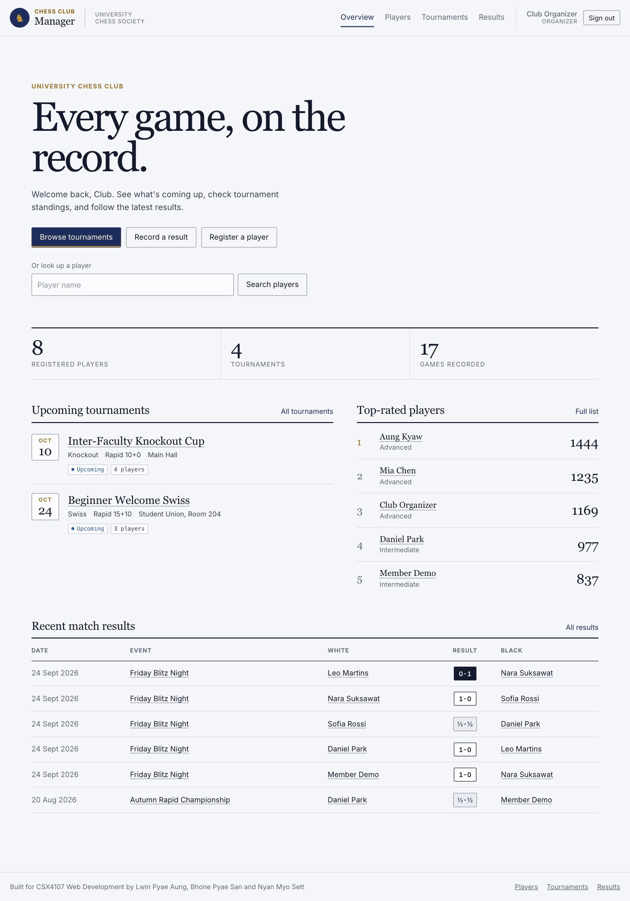
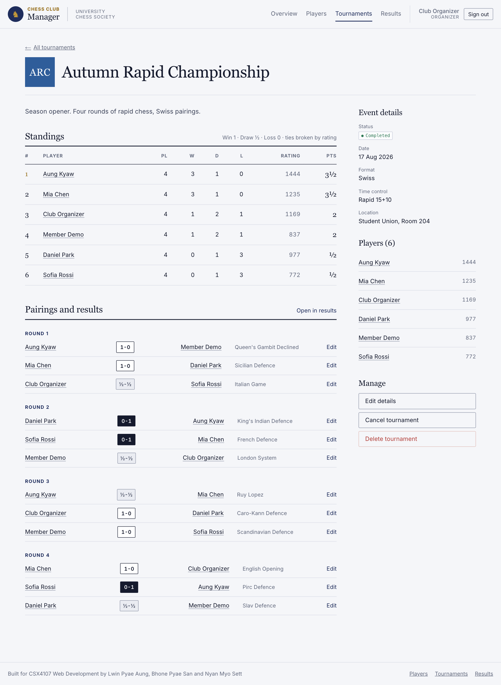
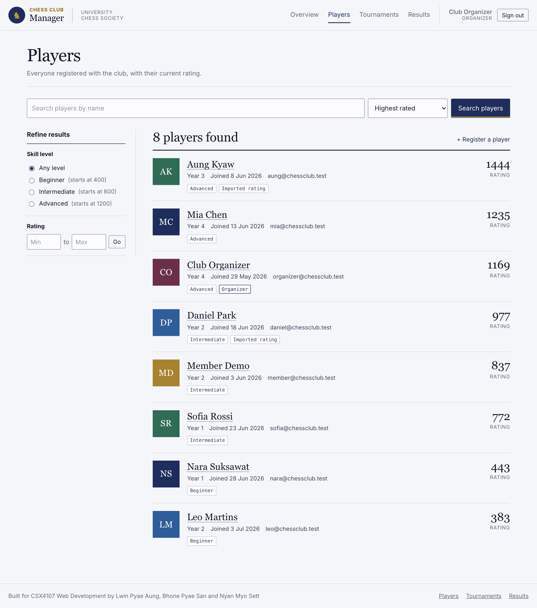
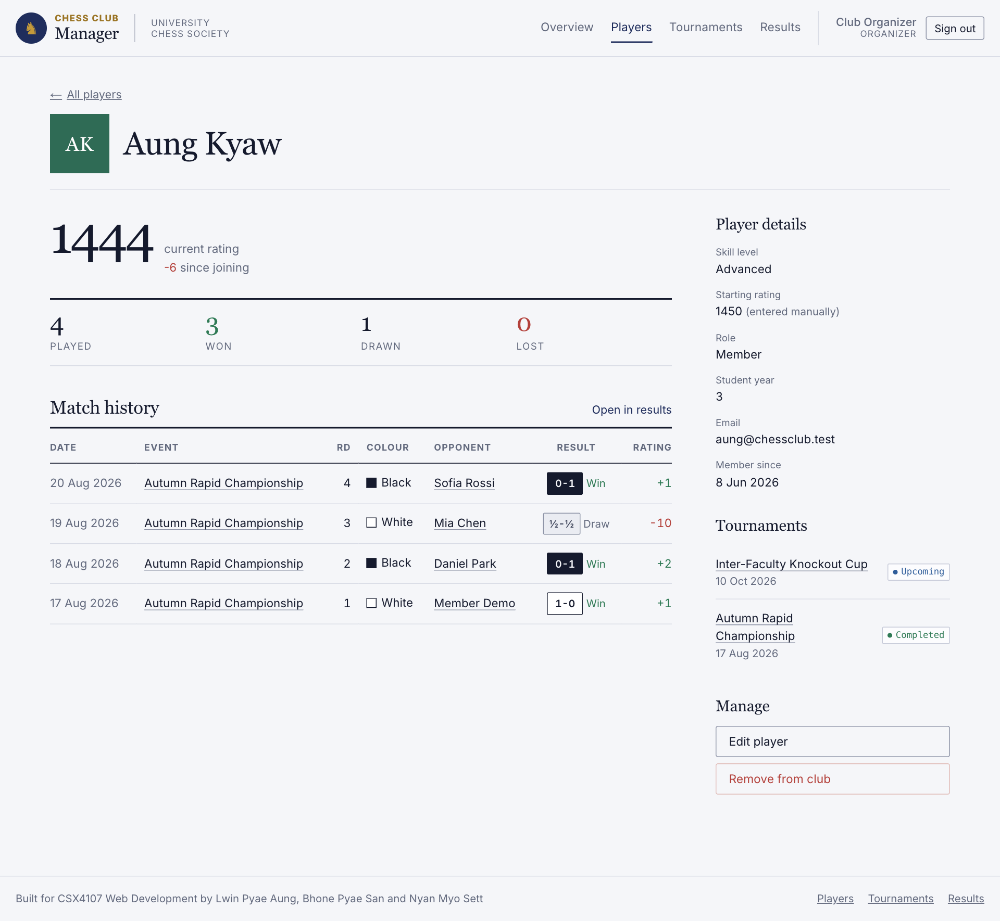
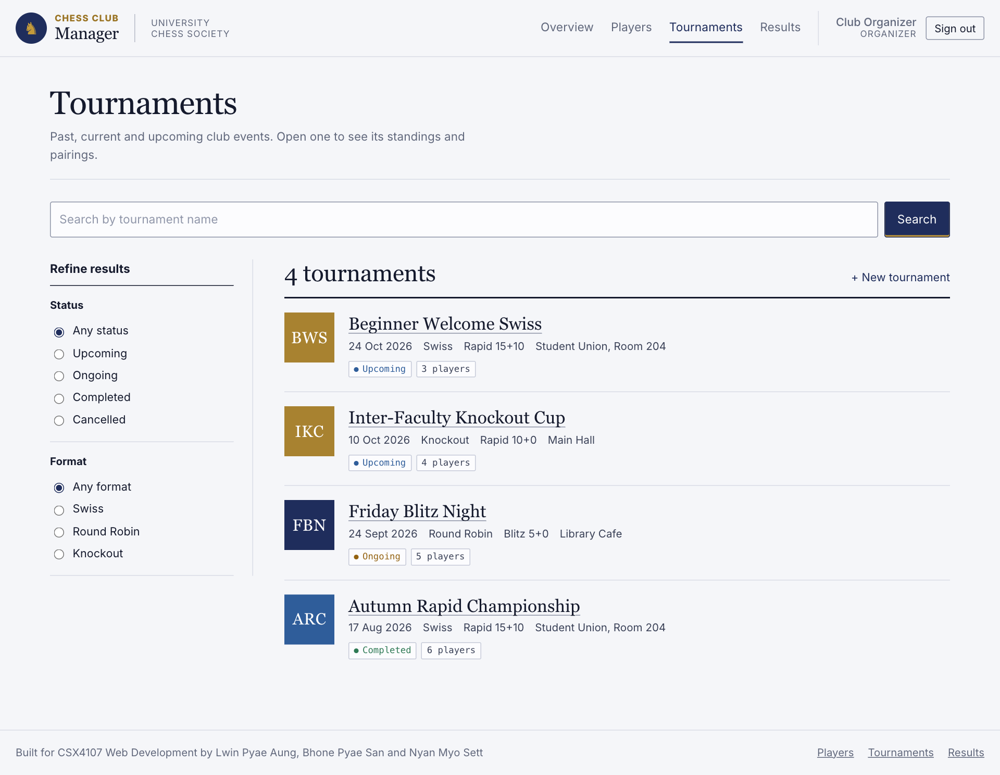
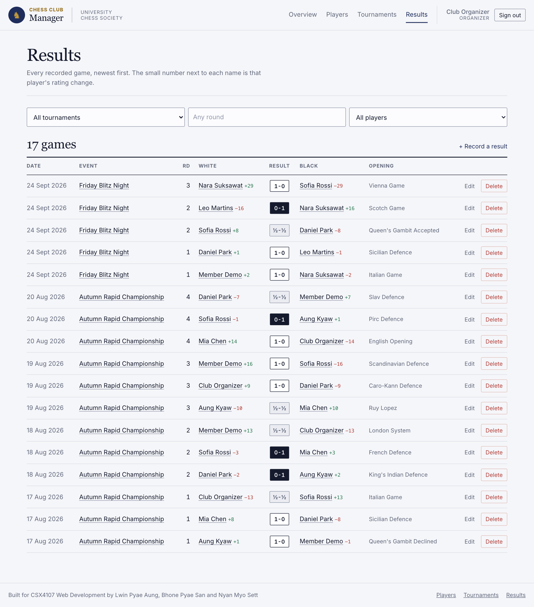
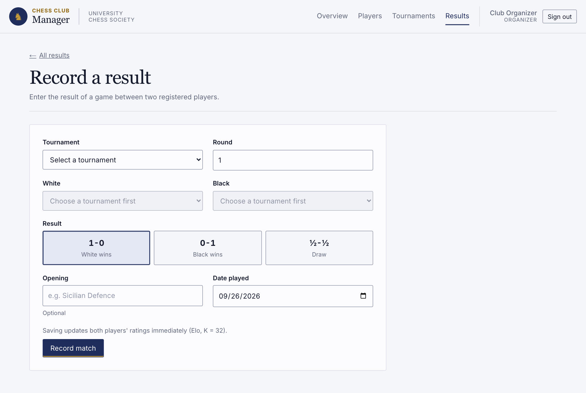
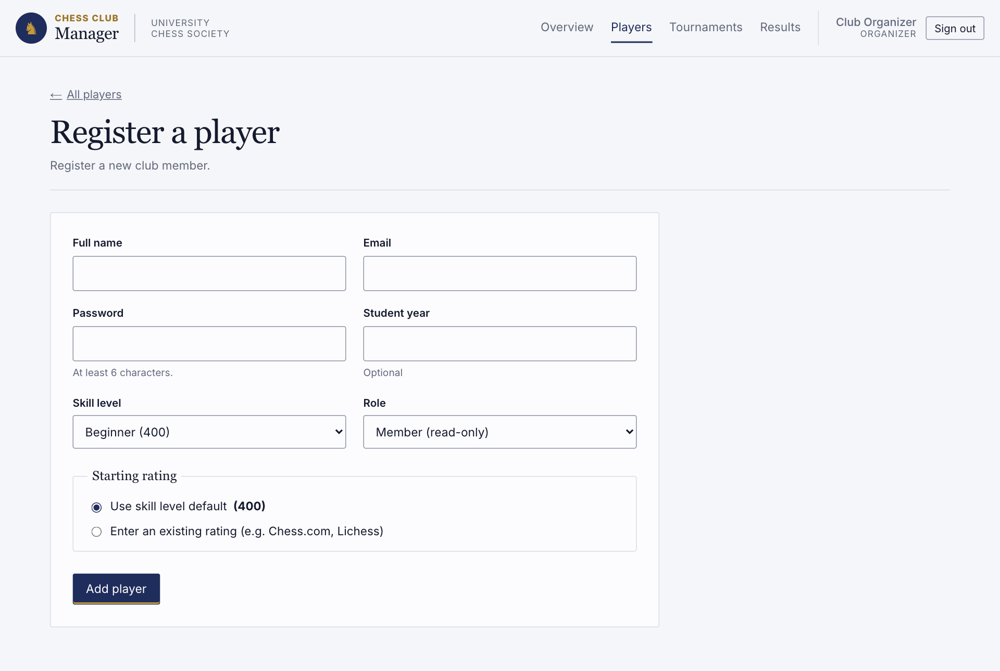
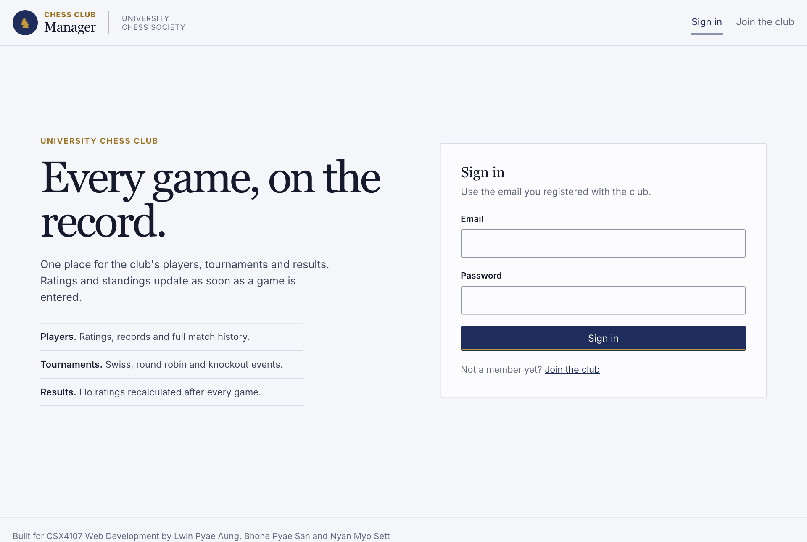
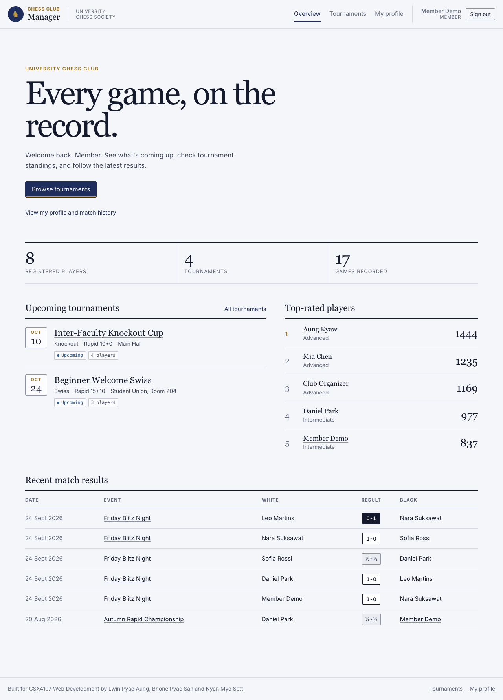

# Chess Club Manager

A full-stack web application for a university chess club to manage its players, organize tournaments, and record match results with automatically calculated ratings and standings.

Built with **Next.js** (App Router, REST API routes) and **MongoDB** (Mongoose).

**Live demo:** `http://<your-vm-ip>/` (replace after deployment)

## Team Members

| Name | GitHub |
| --- | -- |
| Lwin Pyae Aung | [ZaydenMiles](https://github.com/ZaydenMiles) |
| Bhone Pyae San | [kobsan10](https://github.com/kobsan10) |
| Nyan Myo Sett | [NyanCodes](https://github.com/NyanCodes) |

## Project Description

Most student chess clubs track members, tournaments, and game results with group chats, paper score sheets, or shared spreadsheets. Results get lost, ratings are not tracked consistently, and it is hard to see standings or a player's history in one place.

Chess Club Manager gives the club one place to:

- register players and track each player's rating over time
- create tournaments (Swiss, Round Robin, Knockout) and register players into them
- record match results, which immediately update both players' ratings
- view live tournament standings and every player's match history

### Features

- **Dashboard** with upcoming tournaments, top-rated players, and recent match results
- **Players**: create, view, edit, delete. Search by name, filter by skill level and rating range, sort by rating, name or join date. Profile page with W/D/L record, tournaments, and full match history with the rating change from each game.
- **Tournaments**: create, view, edit, cancel, delete. Set format, time control, date, location and status. Register and unregister players. Detail page with standings table and matches grouped by round.
- **Matches**: record, edit, delete. Only players registered in the tournament can be picked. Filter by tournament, round, or player.
- **Authentication**: self-implemented email/password login (bcrypt password hashes, signed JWT in an httpOnly cookie).
- **Roles** (stored as `role` on the Player record):
  - `organizer` (club officer): full access. Create, edit and delete players, tournaments and match results, and manage tournament registration.
  - `member` (player): read-only. Can view the dashboard, tournament schedules and standings, and their own player profile and match history. Cannot create or edit records.
  - Checked in the UI (admin controls and organizer pages hidden) and in every API route (members get `403`), so the rules cannot be bypassed by calling the API directly.

### Rating calculation

Each player starts with either a skill-level default (Beginner 400, Intermediate 800, Advanced 1200) or a rating entered manually at registration (e.g. from Chess.com or Lichess). After that, ratings are updated with a simplified Elo formula:

```
Expected score:  Ea  = 1 / (1 + 10^((Rb - Ra) / 400))
New rating:      Ra' = Ra + K * (Sa - Ea)        K = 32
```

`Sa` is 1 for a win, 0.5 for a draw, 0 for a loss. Whenever a match is created, edited, or deleted, the server replays every match in the order it was played, starting from each player's starting rating ([src/lib/ratings.js](src/lib/ratings.js)). This keeps ratings, and the rating change stored on each match, correct even when an older result is corrected or removed.

### Standings calculation

Standings are calculated per tournament ([src/lib/standings.js](src/lib/standings.js)): win 1 point, draw 0.5, loss 0. Players are ranked by points, and ties are broken by the higher current rating. The table shows rank, games played, wins, draws, losses, and points, and is recalculated on every request so it is always in sync with the match records.

## Screenshots

| | |
| --- | --- |
| **Dashboard**  | **Tournament detail and standings**  |
| **Players**  | **Player profile**  |
| **Tournaments**  | **Matches**  |
| **Record match**  | **Add player**  |
| **Login**  | **Member view (read-only)**  |

## Data Models

| Entity | Fields |
| --- | --- |
| **Player** | name, email, passwordHash, role (organizer/member), studentYear, skillLevel (beginner/intermediate/advanced), startingRatingSource (skill-default/manual-entry), rating, joinedAt, createdAt, updatedAt. `startingRating` is also kept so ratings can be recalculated when a match is edited or deleted. |
| **Tournament** | name, description, format (swiss/round-robin/knockout), timeControl, date, location, status (upcoming/ongoing/completed, plus cancelled when a tournament is cancelled), playerIds, createdAt, updatedAt |
| **Match** | tournamentId, whitePlayerId, blackPlayerId, round, result (1-0 / 0-1 / ½-½), ratingChangeWhite, ratingChangeBlack, opening, playedAt, createdAt, updatedAt |

## REST API

All routes return JSON. All routes except login and register require a session. Routes marked **O** require the organizer role. `GET /api/players/:id` is allowed for organizers and for a member viewing their own profile.

| Method | Route | Description |
| --- | --- | --- |
| POST | `/api/auth/register` | Sign up (always creates a member) |
| POST | `/api/auth/login` | Log in, sets session cookie |
| POST | `/api/auth/logout` | Log out |
| GET | `/api/auth/me` | Current user |
| GET | `/api/dashboard` | Dashboard summary |
| GET | `/api/players?q=&skillLevel=&minRating=&maxRating=&sort=` | **O** List, search and filter players |
| POST | `/api/players` | **O** Create player |
| GET | `/api/players/:id` | Player with record, tournaments, match history (organizer, or the player themselves) |
| PUT | `/api/players/:id` | **O** Update player |
| DELETE | `/api/players/:id` | **O** Delete player (also removes their matches and recalculates ratings) |
| GET | `/api/tournaments?status=&format=&q=` | List tournaments |
| POST | `/api/tournaments` | **O** Create tournament |
| GET | `/api/tournaments/:id` | Tournament with players, matches, standings |
| PUT | `/api/tournaments/:id` | **O** Update tournament (including cancel via `status`) |
| DELETE | `/api/tournaments/:id` | **O** Delete tournament and its matches |
| POST | `/api/tournaments/:id/players` | **O** Register a player `{ playerId }` |
| DELETE | `/api/tournaments/:id/players/:playerId` | **O** Unregister a player |
| GET | `/api/tournaments/:id/standings` | Standings table |
| GET | `/api/matches?tournament=&round=&player=` | **O** List and filter matches |
| POST | `/api/matches` | **O** Record match (updates ratings) |
| GET | `/api/matches/:id` | **O** Match detail |
| PUT | `/api/matches/:id` | **O** Edit match (recalculates ratings) |
| DELETE | `/api/matches/:id` | **O** Delete match (reverses rating changes) |

## Running Locally

Requirements: Node.js 20.9 or newer, and a MongoDB server (local install or Docker).

```bash
# MongoDB via Docker, if you do not have it installed
docker run -d --name chess-mongo -p 27017:27017 mongo:8

npm install
cp .env.example .env.local      # then set JWT_SECRET to a long random string
npm run seed                    # sample data (use "npm run seed -- --reset" to start over)
npm run dev
```

Open http://localhost:3000 and log in with a seeded account:

| Role | Email | Password |
| --- | --- | --- |
| Organizer | organizer@chessclub.test | organizer123 |
| Member | member@chessclub.test | member123 |

Other sample players use the password `player123`.

## Deployment

The production app runs on an Ubuntu VM with PM2 behind Nginx. Step by step instructions are in [docs/DEPLOYMENT.md](docs/DEPLOYMENT.md). Config files: [ecosystem.config.cjs](ecosystem.config.cjs) and [deploy/nginx.conf](deploy/nginx.conf).

## Project Structure

```
src/
  app/            pages (App Router) and api/ route handlers
  components/     shared UI (forms, nav, badges)
  lib/            db connection, auth/session, validation, Elo and standings logic
  models/         Mongoose models: Player, Tournament, Match
  proxy.js        redirects signed-out visitors to /login
scripts/seed.js   sample data
deploy/           Nginx config
docs/             deployment guide and screenshots
```
